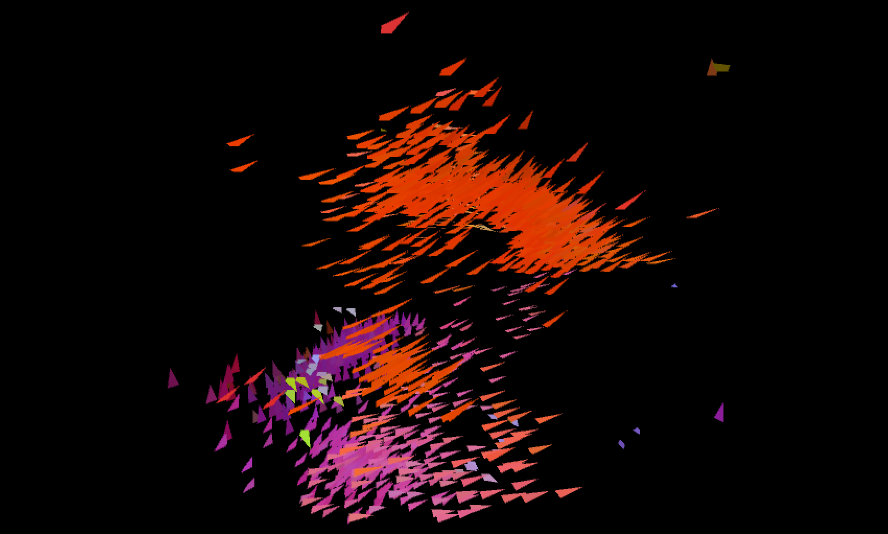

  
  

 
<!--  
 

  a soft, indistinct sound made by a person or group of people speaking quietly or at a distance.
 
 -->

# Experimental Granular Synthesis with Murmur
 
 Murmur is a digital instrument built around collective flocking behavior. It gets its name from "murmuration"-- a group of starlings flocking together, and from many voices speaking indistinctly.

 

The granular synthesizer inside Murmur is controlled by data gathered from the simulated community of "birds." Data like the average location, velocity, separation, and variation in direction of the birds are used to update the parameters of the granular synthesizer engine and play back samples. The flocking simulation is based on Craig Reynold's original 1986 ["Boids"](https://www.red3d.com/cwr/boids/) algorithm (check out Reynold's website for more on the 'Boids' algorithm!), with tweakable parameters.

# About
 
 Murmur is a Java applet made using the [Processing](https://processing.org/) library and IDE, and the [Beads](http://www.beadsproject.net/) library for working with audio files and for the granular synthesis engine. This project is released under the MIT license.
 
 ## Running the Application
 The Window's .exe and OSX .app can both be downloaded from the releases page.
 The OSX app comes packaged with java, but to run the window's executable you'll need to download [OpenJDK](https://jdk.java.net/).
 
 Unforunately, Murmur is a self-signed app and might not be trusted by your mac. [Here's](https://support.apple.com/guide/mac-help/open-a-mac-app-from-an-unidentified-developer-mh40616/mac) Apple's how-to for opening unidentified software if your computer won't run it.
 
 To run or edit murmur from within the [Processing IDE](https://processing.org/download) download the "murmur" folder and open any of the .pde files inside of it.  Once you've opened the sketch in the IDE, download the Beads library using Processing's library loader, and you should be able to run it as a normal processing sketch.
 
 ## Controls
 
 Clicking anywhere on the screen "freezes" the flock simulation, pressing 'c' clears the screen, and pressing any other key shows/hides the button layout.
 
 ### Audio engine
  Toggling each audio button connects the corresponding flock data to the following granular synthesis parameter:

 - space between birds --> sample pitch
 - position --> L/R pan
 - speed --> grain rate
 - distance from cursor --> grain size
 - speed --> gain
 - distance from cursor --> noise
 - L/R velocity --> playback direction (fwd/rev)

The last orange and the round red button allow you to load and save recorded samples, respectively. Murmur currently can load in .mp3 and .wav files, and records to .wav files by default.

Murmur's second window displays button tooltips and a waveform of the current audio. Additionally, .mp3 and .wav audio files can be dropped onto the second window to load them into Murmur.

### Murmuration
Buttons along the top of the screen control murmur's visual appearance. From left to right, these buttons let you:
- freeze flock redrawing, letting you visualize the path of each bird over time
- show the average position of the murmuration, colored by the average direction of all birds within it.
- show the orbit radius around the cursor.
- color each bird by its unique color, or by its velocity vector. Velocity by default, which *usually* helps visually highlight the subflocks within the group.
- toggle between different background colors
 
 

  # Quick Tips
 - Start with your system volume **low!** Use the slider in the lower right hand corner to adjust murmur's volume as it plays.
 - Choose rich audio, in volume, texture, and structure. The more varied your source sample is, the more complex murmur's output can be.
 - Turn **pitch** off for more melodic sounds. It's on by default, and I love it, but it crunches up any melodic character fed into the murmuration. If you want more ambient, harmonically-sane sounds I recommend keeping it off.
 - **Record!** You can record yourself playing with murmur, do it.
